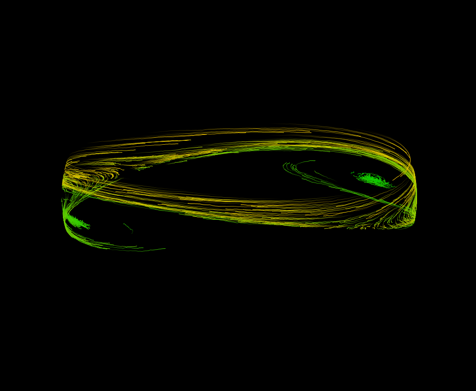

# Macrospin-GPU



Use PyOpenCL to run GPU code over many realizations of the Weiner process. A
convenient Jinja2-based templating system is used to allow easy specification of
physical geometry, magnetic properties, arbitrarily many spin-torque terms, and
more.

# Dependencies

* [PyOpenCL](http://mathema.tician.de/software/pyopencl/) for computation
* [PyOpenGL](http://pyopengl.sourceforge.net/) for visualization
* [tdqm](https://github.com/noamraph/tqdm) for progress bar
* [jinja2](http://jinja.pocoo.org/docs/dev/) templating GPU kernels

# Installation

Installing `macrospin_gpu` itself is quite simple. It's best to ensure that
PyOpenCL is properly installed (as described below) before continuing. At that
point you should simply be able to run:

```shell
git clone git@github.com:BBN-Q/macrospin_gpu.git
cd macrospin_gpu
pip install -e .
```

Try out some of the examples in `scripts/` to get started. Eventually I'll add
some legitimate documentation, but until that point the examples should be sufficient.
OpenGL visualizations can be seen in the `scripts/costm-visualization.py` script.

## OS X
Installing PyOpenCL with pip can be unreliable. It is best to clone the github
repository and work from there. Instead of working from the lastest and greatest
version you may want to check out a recently tagged release:

```shell
git clone git@github.com:pyopencl/pyopencl.git
cd pyopencl
git checkout v2016.2.1
python configure.py
make -j4
make install
```
In more recent builds of PyOpenCL, OpenGL interoperation should come for free.
Older versions required configuring with the `--cl-enable-gl` option.

It may be possible to use PyOpenCL from Anaconda, but I have not had a chance to
test this path.

## Windows
Use the Anaconda python distribution.

## Linux

It may be possible to use PyOpenCL from Anaconda, but I have not had a chance to
test this path. There is a bit more configuration to be done on Linux.

### NVIDIA Drivers with Prime

Tested on Linux Mint 18 with nvidia 361 drivers.  Have installed following
packages: `nvidia-361,``nvidia-opencl-icd-361`, `nvida-settings`, `nvidia-prime`
for NVIDIA support and the generic `opencl-header`, `ocl-icd-libopencl1` and
`ocl-icd-opencl-dev` for building OpenCL program and `clinfo` to see if anything
works. Need to have Nvidia card powered up using Prime.

### Build and install PyOpenCL
Again, manually building is recommended.

  ```shell
  git clone git@github.com:pyopencl/pyopencl.git
  cd pyopencl
  git checkout v2016.2.1
  python configure.py --cl-inc-dir=/opt/intel/opencl-1.2-sdk-5.0.0.43/include/ \
                      --cl-lib-dir=/opt/intel/opencl-1.2-5.0.0.43/lib64/
  make -j4
  make install
  ```
